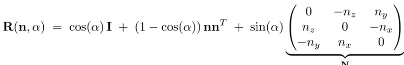

# Notes-3/4-Transformations

## 03 Transformations

### 齐次坐标

齐次坐标引入是为了线性表示仿射变换（线性变换+平移变换）

主要是因为平移变换引入了常数项，不是线性变换

- 2D点的表示：(x,y,1)^T
- 2D向量的表示：(x,y,0)^T

这样可以保证点和向量之间加减后，类型不变（点+向量，点-点，向量+向量）

齐次坐标的归一化(x/w, y/w, 1)

### 2D 变换

- scale(uniform/non-uniform)
- reflection
- shear 切变
- rotation (默认绕原点，逆时针)
- 有结合律 变换顺序需要注意 右边先变换
- 分解：如何绕给定的c点旋转？
    - T(C) * R(a) * T(-C) 先平移回原点，再旋转，再平移回C点
- 线性变换再应用平移

- 3D 变换
    - (x, y, z, 1)——(x, y, z, 0)

## 04 Transformations 2

### 3D Transformations

- 绕坐标轴： 循环对称
- R_xyz(a,b,c) = Rx(a)Ry(b)Rz(c)  (roll, pitch, yaw)
- 任意旋转：

### Viewing transformations

- view/camera transformation  也叫 model/veiw transformation
    - place model
    - place camera
        1. position e
        2. look at/gaze direction  g
        3. up direction  t
        
        约定：相机永远在原点， 向-z 看，up at Y
        
        如何实现想要的位置？M_view:  
        
        
        
        M_view = R_view * T_view 所有物体和相机一起做这个变换
        
        这里的R_view 如何求出来的？ 表示的旋转是： (1,0,0,0)→ (x_gt, y_gt, z_gt, 0)以此类推 
        
        
        
    - projection
- projection transformation
    - 3D → 2D
    - orthographic projection  正交投影 平行依然平行
        - 定义： [l,r]*[b,r]***[f,n]** 立方体到[-1,1]^3  （f<n，因为看向的是-z方向）（右手系的结果 也是一些如opengl 的api使用左手系的原因
        
        
        
        - 先平移再缩放
        - 导致了拉伸怎么办？视口变换
    - perspective projection 透视投影
        - 先挤压（近、远的z不变，中心的相对位置也不变）再正交投影
        - M_squeez根据远近的不同决定scale比例的不同
        - 
        
        
        
        - 变换如下（推导方式：先确定x和y变换后的位置，再利用近远平面的不变性）
            
            